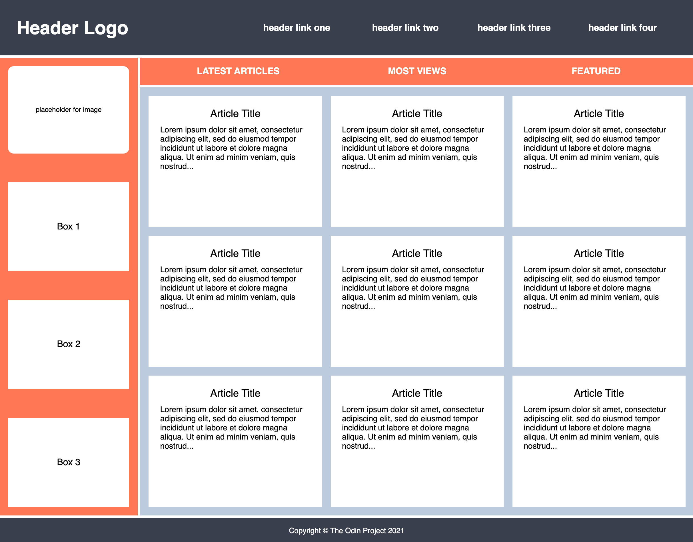
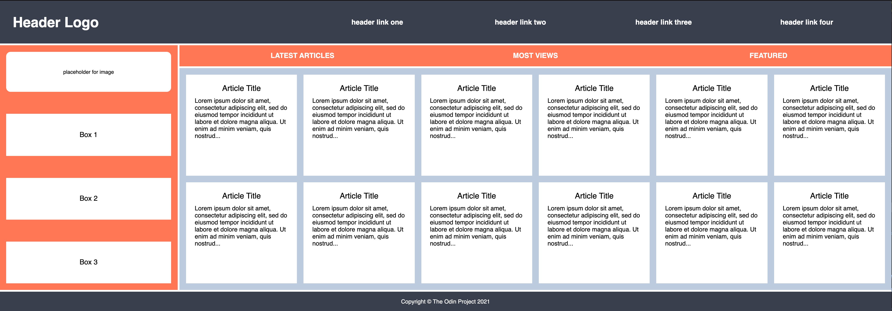

# css-practice2

Additional practice with grid.  This excercise is from The Odin Project curriculum.

---

This time we'll be working from a slightly more complex template:

---

And, if I've used my CSS properly, on a wider screen I should get something like this:

